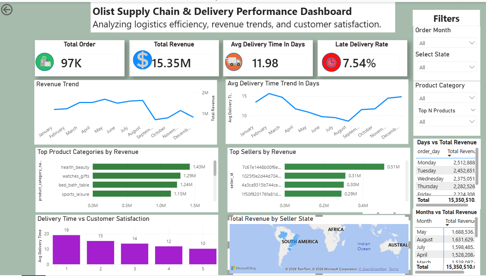
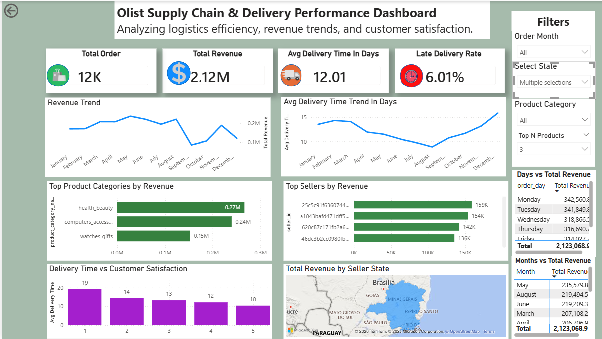
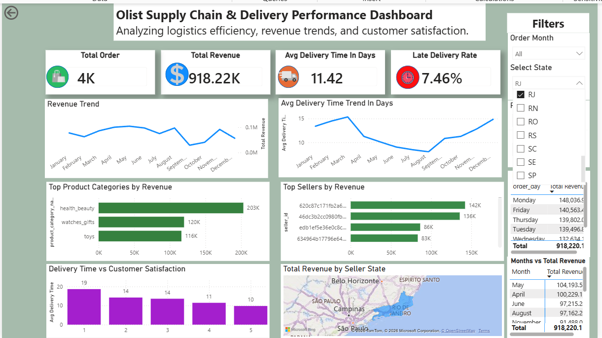
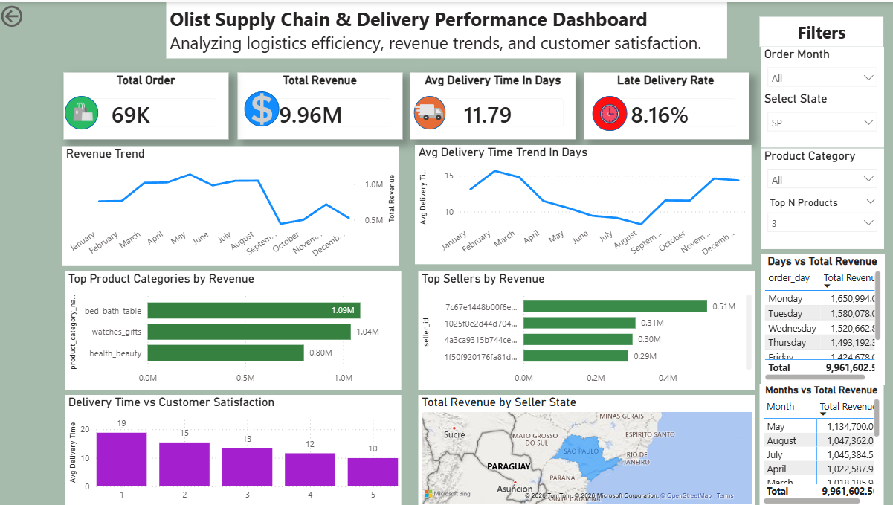

# olist-supply-chain-analysis
Analysis and visualization of a Brazilian e-commerce store
## Dashboard Preview

## States' Dashboard Preview
### Bahia State

### Minas Gerias State

### Rio de Janeiro State

### Sao Paulo State

Olist Supply Chain & Delivery Analysis
Project Overview
This project analyzes a real-world Brazilian e-commerce dataset to uncover insights into delivery performance, customer satisfaction, and revenue trends.
________________________________________
Objectives
•	Analyze delivery efficiency
•	Identify late delivery patterns
•	Evaluate seller performance
•	Understand revenue drivers
•	Explore customer satisfaction trends
________________________________________
Tools Used
•	Python (Pandas, Numpy, Matplotlib)
•	Power BI (DAX, Dashboard Design)
•	Jupyter Notebook
________________________________________
Dataset
Brazilian E-Commerce Public Dataset (Olist)
________________________________________
Key Insights 
•	Average delivery time: 12 days
•	Late delivery rate: 7.54%
•	Top-performing states: Sao Paulo (SP), Rio de Janeiro (RJ), and Minas Gerais (MG)
•	Top product categories: female fashion clothing, diapers and hygiene, and fashion sport wears
•	Faster deliveries lead to better review scores
________________________________________
How to Run
1.	Clone the repository
2.	Open notebook in Jupyter
3.	Run all cells
________________________________________
Business Value
This analysis helps e-commerce businesses:
•	Improve delivery efficiency
•	Reduce delays
•	Optimize seller performance
•	Enhance customer satisfaction
________________________________________
Project Highlights
•	Real-world dataset 
•	End-to-end analysis 
•	Interactive dashboard 
•	Business-driven insights 

Author
Jimoh Sikiru Abiola

